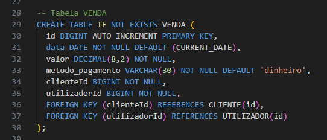
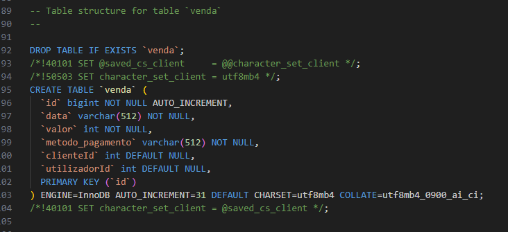

# C6 : API

---

## Escolhas de Implementação e Problemas

- Datas e horas definidas como `string` com a finalidade de evitar problemas de compatibilidade **baseado em indicação direta do professor**.

- `@belongsTo` e `@hasOne` usados para modelar relações foco em manter estrutura coerente e simples para testes e manutenção.

- `Request POST /stocks failed with status code 500. Error: Check constraint 'stock_chk_1' is violated.` - Erro encontrado ao trabalhar com a Entidade `Stocks`, não conseguimos resolver mas entendemos que a sua origem é devido ao CHECK existente no atributo `quantidade`.

## SQL Migrate

| original | migrate |
|-------|-------|
|  |  |

**Comparação entre CREATE TABLE do MySQL e o CREATE TABLE do SQL Loopback**

- Pela falta de especificação de tamanho de domínios o LoopBack converteu para VARCHAR(512) todos os strings.

---

| [< Previous](rpf05.md) | [^ Início](rpf00.md) | [Next >](rpf07.md) |
| :---------------------- | :-------------------: | ------------------: |
